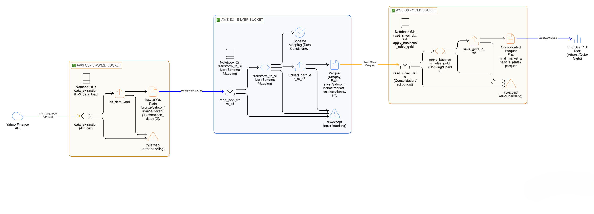

# 💹 Stock Market Data Lakehouse: Medallion Architecture on AWS

Este repositório contém um pipeline de dados completo para monitoramento de ativos financeiros, estruturado sob os princípios de um **Data Lakehouse** utilizando a **Arquitetura Medalhão** (Bronze, Silver e Gold).

---

## 🌎 Idiomas / Languages
- [**Português (Brasil)**](#-português-brasil)
- [**English**](#-english)

---

## 🇧🇷 Português (Brasil)

### 📝 Descrição do Projeto
O objetivo deste projeto é extrair dados reais da API Yahoo Finance, processá-los via Python e armazená-los de forma estruturada no AWS S3. O pipeline demonstra práticas avançadas de engenharia de dados, como o uso de formatos colunares (Parquet) para otimização de custos e performance em nuvem.

### 🏗️ Arquitetura do Sistema

### 🛠️ Camadas de Dados
* **Bronze (Raw):** Ingestão de dados brutos em formato JSON via `yfinance`. Os arquivos são particionados por `ticker` e `extraction_date`, garantindo a rastreabilidade da fonte original.
* **Silver (Staging):** Limpeza de dados e mapeamento de schema. Conversão de JSON para **Apache Parquet com compressão Snappy**, otimizando o armazenamento e a velocidade de leitura.
* **Gold (Analytics):** Consolidação dos dados. Aplicação de lógica de ranking por Market Cap e cálculo de métricas de valorização (*Upside Potential*). Dados prontos para consumo por ferramentas de BI.

### 🧰 Tecnologias Utilizadas
| Tecnologia | Função |
| :--- | :--- |
| **Python** | Linguagem principal e lógica de ETL. |
| **Pandas** | Manipulação e transformação de dados. |
| **Boto3** | SDK oficial da AWS para integração com S3. |
| **AWS S3** | Armazenamento de objetos (Data Lake). |
| **Google Colab** | Ambiente de desenvolvimento e execução. |
| **Apache Parquet** | Formato de armazenamento colunar otimizado. |

### ⚙️ Configuração
O projeto utiliza segredos do Google Colab para segurança. Configure as seguintes variáveis:
- `AWS_ACCESS_KEY_ID`
- `AWS_SECRET_ACCESS_KEY`
- `AWS_REGION`

### 🚀 Próximos Passos
* Implementar orquestração via **AWS Lambda** ou **Apache Airflow**.
* Configurar **AWS Athena** para consultas SQL diretamente no S3.
* Criar dashboards no **Amazon QuickSight** ou PowerBI.

---

## 🇺🇸 English

### 📝 Project Description
This project implements a robust data pipeline for financial asset monitoring, using a **Medallion Architecture** (Bronze, Silver, and Gold). It extracts real-time data from the Yahoo Finance API, processes it through Python, and stores it in an AWS S3-based **Data Lakehouse**.

### 🏗️ System Architecture

### 🛠️ Data Layers
* **Bronze (Raw):** Raw data ingestion in JSON format using `yfinance`. Files are partitioned by `ticker` and `extraction_date` for full traceability.
* **Silver (Staging):** Data cleaning and schema mapping. Conversion from JSON to **Apache Parquet with Snappy compression** for cost-effective storage and high-performance querying.
* **Gold (Analytics):** Business logic layer. Includes data consolidation, Market Cap ranking, and *Upside Potential* metrics. Data is ready for BI consumption.

### 🧰 Tech Stack
| Technology | Role |
| :--- | :--- |
| **Python** | Core ETL logic and processing. |
| **Pandas** | Data manipulation and transformation. |
| **Boto3** | AWS SDK for S3 integration. |
| **AWS S3** | Cloud Object Storage (Data Lake). |
| **Google Colab** | Development and execution environment. |
| **Apache Parquet** | Optimized columnar storage format. |

### ⚙️ Configuration
The project uses Google Colab secrets. Set up the following variables:
- `AWS_ACCESS_KEY_ID`
- `AWS_SECRET_ACCESS_KEY`
- `AWS_REGION`

### 🚀 Next Steps
* Automate orchestration using **AWS Lambda** or **Apache Airflow**.
* Enable **AWS Athena** for SQL queries on top of the S3 Gold layer.
* Build visual dashboards with **Amazon QuickSight** or PowerBI.
